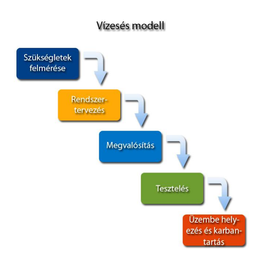
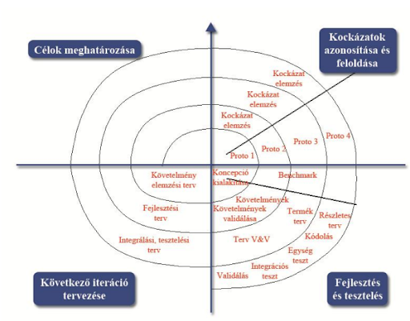
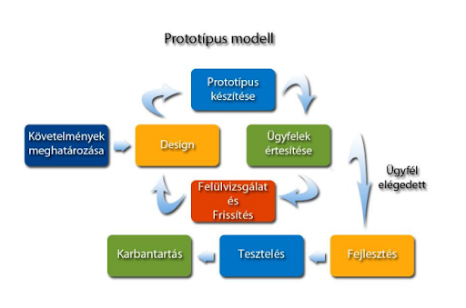
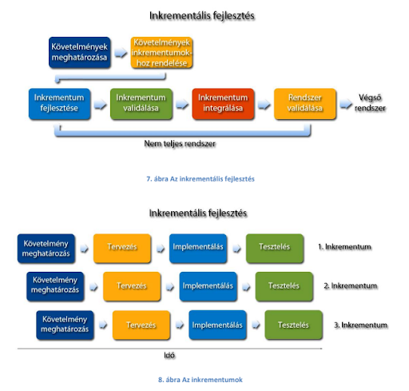

# 6M. Tétel: Szoftverfejlesztési módszertanok

## Hagyományos szoftverfejlesztési módszertanok

- A strukturált módszertanok a feladatot modulokra bontják, az implementációban is ajánlott a program modulokra bontása. Ezért a strukturált programozási nyelveket részesítik előnyben.
- Mivel az objektum orientált nyelvek is strukturáltak, ezért azokkal együtt is használhatók.
- Jellemzője, hogy az életciklus lépései merev sorrendben követik egymást, azaz lineáris. Ezek a módszertanok nagy, hosszú ideig tartó projektek megvalósítására valók. Közös jellemzőjük, hogy nehézsúlyúak, azaz sok és részletes dokumentációval próbálják meg elkerülni a félreértéseket.
- Tehát a strukturált módszertanok:
  - Lineárisak
  - Jól dokumentáltak
  - Adat és folyamat központúak
  - Nehézsúlyúak
- Jelentése gyűjtőfogalom.
- Ezek jelentek meg elsőnek és terjedtek el széles körben.
- Megjelenésük idején azt gondolták, hogy ezek a módszertanok lesznek a szoftverkrízis megoldói.
- Példa: Vízesés modell, v-modell.

### Vízesés modell

- A vízesés modell (waterfall model) volt az első módszertan, ami széles körben elterjedt. Ez egy strukturális módszertan, ezek közül is a legismertebb. Nagy megrendelők nagy projektjeihez alakították ki.
- Mivel a nagy megrendelők általában rugalmatlanok, ezért előnyös, hogy a módszertan kevés döntési pontot definiál.
- A modell lineáris, azaz az életciklus lépései egymás után, átfedés nélkül következnek.
- A módszertan ipari termelésből ered, ahol nincs lehetőség a követelmények változtatására, ha már egyszer azokat meghatároztuk, ezért a vízesés modell nem engedi, hogy már egy lezárt fázisba visszatérjünk.
- Ez azért lehetséges, mivel csak akkor léphetünk a következő fázisba, ha az előzőt már lezártuk.
- A modell rengeteg dokumentum elkészültét írja elő, amit el kell fogadtatni a megrendelővel, ezzel véli biztosítani a módszertan, hogy nincs félreértés a megrendelő és a szoftvercég között.
  Sajnos a sok dokumentumot ritkán olvassa el tüzetesen a megrendelő.
- A következő fázisokat írja elő:
  - Szükségletek felmérése
  - Rendszertervezés
  - Megvalósítás
  - Tesztelés
  - Üzembe helyezés és karbantartás
- A sorrend nem felcserélhető, egymás után következnek!
  

### V-modell

- Nevét onnan kapta, hogy két szára van.
- Az egyik szára megegyezik a vízesés modellével, ez a fejlesztési szár.
- A másik szára a létrejövő termékek tesztjeit tartalmazza, ez a tesztelési szár.
- Az egy szinten lévő fejlesztési és tesztelési lépések összetartoznak, azaz a tesztelési lépés a fejlesztési lépés során létrejött dokumentumokat használja, vagy a létrejött terméket teszteli.
- Ez a modell a vízesés modell kiegészítése teszteléssel.
- Először a fejlesztési lépéseit végre kell hajtani, utána jön a tesztelés.
- Ha valamelyik teszt hibát talál, akkor vissza kell menni a megfelelő fejlesztési lépésre.
- Jobban elterjedt, mivel az alkalmazói nem annyira ragaszkodnak a merevséghez.
- Fázisai: - Követelményspecifikáció elkészítése - Ha rosszul készül el, az igényeknek nem megfelelő szoftver fog készülni - Funkcionális specifikáció elkészítése - Leírja, hogyan kell működnie a szoftvernek, rendszerteszt alapja - Rendszerterv - Funkciók hogyan és milyen komponensekkel fognak megvalósulni - Implementáció - Tesztelés - Integrációs teszt - Rendszerterv alapján - Rendszerteszt - Funkcionális specifikáció alapján
  

### Spirális fejlesztési modell

- Gyakorlatban csak elvétve használják, elvi jelentősége nagy.
- A modell a prototípus modell és a vízesés modell egyes tulajdonságait kombinálja.
- Nagy, bonyolult, drága rendszerekhez ajánlott.
- Jelentőségét az adja, hogy első modell, amely egyfajta iterációt használ.
- Esetében a spirál mindig ugyanazon a négy fázison halad:
  - Célok meghatározása
  - Kockázatok azonosítása és feloldása
  - Fejlesztés és tesztelés
  - Következő iteráció tervezése
- A fázisok kezdetén meg kell határozni a célokat és a fázis végére egy működőképes prototípust kell előállítani, úgy, hogy a prototípusok minden fázis után egyre inkább közelítsenek az elérendő végtermék felé.
- Nagyon fontos a kockázati elemzés is a model minden fázisában, hiszen a megrendelő a prototípusra azt is mondhatja, hogy ez így nem jó és az elvégzett munka kárba veszhet.
- Az utolsó fázisban a spirál és a vízesés modell nagyon hasonló, ugyanis ekkorra már a prototípusok készítésével pontosan tudjuk, hogy hogyan kell kinéznie, működnie a szoftver végleges verziójának.

### Prototípus alapú fejlesztés

- Ez a modell a válasz a vízesés modell sikertelenségére.
- A fejlesztő cégek rájöttek, hogy tarthatatlan a vízesés modell megközelítése, hogy a rendszerrel a felhasználó csak a projekt végén találkozik.
- Gyakran ekkor derül ki, hogy az életciklus elején félreértették egymást a felek és nem a valós követelményeknek megfelelő rendszer született.
- A prototípus modell azt mondja, hogy végső átadás előtt több prototípust is szállítsunk le, hogy mihamarabb kiderüljenek a félreértések, illetve a megrendelő lássa, mit várhat a rendszertől.
- A prototípus alapú megközelítése a fejlesztésnek azon alapszik, hogy a megrendelő üzleti folyamatai követelményei nem ismerhetők meg teljesen.
- A követelményeken érdemes finomítani a prototípusok segítségével.
- Ha a felhasználó használatba vesz egy prototípust, akkor képes lesz megfogalmazni, hogy miért nem felel meg az az elvárásainak, és mit kell változtatni rajta.
- Ez a megközelítés annyira sikeresnek mondható, hogy a modern módszertanok majd mindegyike prototípus alapú.
- Az agilis módszertanok majd minden nap új prototípust állítanak elő.
- Lépései:
  - Alapkövetelmények meghatározása
  - Kezdeti prototípus fejlesztése
    - Felhasználói felület elkészítése, mögötte funkciók nem szükségesek
  - Bemutatás
    - A végfelhasználók megvizsgálják
  - A követelmények pontosítása
    - Ha nem elég pontos még, akkor továbbfejlesztés majd újból bemutatás.
- Az eldobható prototípus lehet papír alapú vagy grafikus felületű.
- Előnyei:
  - Minőségnövelés
  - Költségcsökkentés
  - Erősíti a felhasználó bevonását

### Iteratív és inkrementális módszertanok

- Az iteratív módszertan előírja, hogy a fejlesztést kezdve az igényfelméréstől az üzemeltetésig, kisebb iterációk sorozatára bontsuk.
- Itt minden iterációban van tervezés és implementáció is.
- A folyamatos finomítás lehetővé teszi, hogy megértsük a feladatot és felderítsük az ellentmondásokat.
- Azok a módszertanok, melyek a folyamatra teszik a hangsúlyt, azaz az iterációra, azokat iteratív módszertanoknak nevezzük.
- Azokat, amelyeket az iteráció termékére, azaz inkrementumra teszik a hangsúlyt, azokat inkrementális módszertanoknak nevezzük.
- A kiegészítést inkrementumnak is nevezzük.
- Kiegészítés hatására növekvő rendszert tesztelni kell (unit teszt).
- Lépések:
  - Üzleti folyamatok elemzése
  - Követelményelemzés
  - Elemzés és tervezés
  - Implementáció
  - Tesztelés
  - Értékelés
    - Minden tesztelés végén megnézzük, hogy az adott iterációt elfogadjuk e, ha nem, akkor újra indul ez az iteráció.
    - Ha igen, vége az iterációnak.
- Előnye:
  - Életciklus lépései nem egymás után jönnek, mint a strukturált módszertanok esetén, hanem időben átfedik egymást.
  - Minden iterációban van elemzés,tervezés,implementáció és tesztelés.

### Gyors alkalmazásfejlesztés

- Lényege a szoftver gyorsabb és jobb minőségű elkészítése.
- Ezeket úgy érhetjük el, ha:
  - Korai prototípuskészítés és ismétlődő felhasználói átvételi tesztek
  - Szigorú ütemterv
  - Követelmények összegyűjtése
  - Komponensek újrahasznosítása
- OOP programozással kapcsolódik össze.
- A RAD előnye a gyorsaság, mivel rövid idő alatt nem változnak a követelmények.
- Az elemzés, tervezés, megvalósítást és a tesztelést rövid, ismétlődő ciklusok sorozatába tömöríti.
- Általában iteratív.
- Fejlesztési lépések:
  - Üzleti modellezés
  - Adat modellezés
  - Folyamat modellezés
  - Alkalmazás előállítása
  - Tesztelés

## Agilis szoftverfejlesztési módszertanok

### Az agilis szoftverfejlesztés alapjai

- Iteratív szoftverfejlesztési módszerek egy csoportjára utal.
- Fontos, hogy a fejlesztők folyamatosan tanuljanak, így alkalmazkodva a projekthez.
- Agilis fejlesztés szempontjából fontosabb:
  - A működő szoftver szemben a sok dokumentációval
  - Az együttműködés a megrendelővel
  - Alkalmazkodás a változásokhoz
  - Egyén és az interaktivitás
- Alapelvei:
  - Legfontosabb a megrendelő kielégítése használható szoftver gyors és folyamatos átadásával
  - A követelmények késői változtatása sem okoz problémát
  - A prototípus / működő szoftver átadása a lehető legrövidebb időn belül
  - Napi együttműködés a fejlesztők és a megrendelő között
  - Motivált fejlesztők
  - Hatékony kommunikáció
  - Egyszerűség
  - Gyakori időközönként változtatások megvitatása
- Példa:
  - Scrum
  - Extrém Programozás
  - Közös pontjaik:
    - Kevesebb dokumentáció
    - Növekvő rugalmasság
    - Könnyebb kommunikáció
    - Megrendelő bevonása
- A projektet apró részekre bontják, és mindig egy kisebb darabot tesznek hozzá a termékhez, ezeket egytől négy hétig terjedő ciklusokban.
- Abból az elvből hasznos ez, hogy egy szoftvert nem lehet minden részletre kiterjedően megtervezni, vagy a megrendelő változtat valamit.
- Kisebb csapatokban dolgoznak (5-9 fő).
- Tehát:
  - Iteratív
  - Agilis
  - Prototípus alapú
  - Gyakran objektum orientált

### Egy szabadon választott agilis módszertan részletes bemutatása

- Scrum (szabadon választott):
- Egy agilis szoftverfejlesztési metódus.
- Alapjait a rugby nevű csapatjátékból meríti.
- Jelentős szerepet tulajdonít az összetartásnak.
- Sok a találkozó, kommunikációt, lehetőség a problémát átbeszélésére.
- Ajánlás szerint, jó, ha a csapat egy helyen dolgozik és szóban kommunikál.
- Fejlesztési folyamata:
  - A product owner létrehoz egy backlogot, amelyre a teendőket felviszi felhasználói sztoriként.
  - Sztorikat prioritással kell ellátni és megmondani, mi az üzleti értékük. Ez a product owner feladata.
  - Sprint planning meetingen a csapat tagjai megbeszélik, hogy mely storik megvalósítását vállalják el.
  - A sztorikat kisebb feladatokra bontják, hogy megbecsülhessék, az mennyi időt fog igényelni.
  - Ezután jön a sprint, ami 2-4 hétig tart.
  - A sprint időtartamát az elején fixálja a csapat, ettől eltérni nem lehet.
  - Ha nem sikerül időben befejezni, általában büntetést von maga után.
  - A sprinten belül a csapat és a Scrum Master naponta megbeszélik a történteket a Daily meetingen. Itt mindenki elmondja, hogy mit csinált és mi a következő feladata.
  - A sprint végén van a sprint review, ahol a csapat bemutatja az elkészült sztorikat, amiket vagy elfogadnak, vagy nem.
  - Végén a sprint retrospective találkozó van, ahol a sprint során felmerült problémákat tárgyalja át a csapat.
  - A fejlesztett termék az előtt piacra kerülhet, hogy minden sztorit megvalósítottak volna.
  - A projekt változásaira úgy reagál, hogy a backlog folyamatosan változhat, az erre épülő dokumentumok folyamatosan finomodnak.
  - Tökéletesre fejleszti a csapaton belüli hatékonyságot.
  - Röviden:
    - Előre megbeszélt hosszúságú (2-4 hét).
    - Sprint planninggel kezdődik, majd Retroprective-vel zárul.
    - A folyamatot addig kell ismételni, míg a backlog-ról el nem tűnik minden feladat.
    - Minden sprint végére egy potenciálisan leszállítható szoftvert kell előállítani a csapatnak.
    - Akadályokat a Scrum Masternek kell megoldani.
    - Csapatközpontú, agilis, iteratív, prototípus alapú, objektum orientált.

